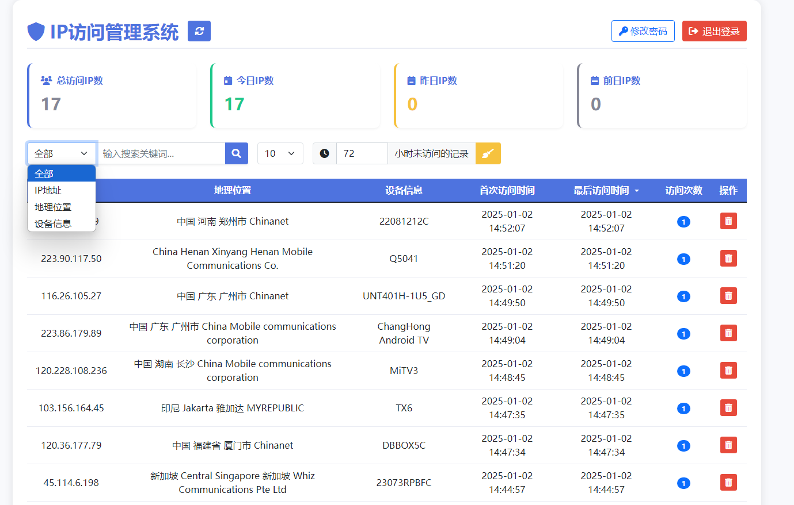

# ip验证管理系统

一个简单高效的IP访问管理系统，用于记录和管理IP访问记录，支持地理位置显示和设备信息识别。



## 功能特点

- IP访问记录和管理，验证
- IP地理位置自动识别
- 设备信息识别
- 访问统计和分析
- 分页和搜索功能
- 数据自动清理

## 系统要求

- PHP 7.0+
- MySQL 5.6+
- Web服务器（Apache/Nginx）
- PHP扩展：
  - mysqli
  - curl
  - mbstring
  - json

## 安装步骤

1. ### 创建数据库

   ```
   CREATE DATABASE ipapi CHARACTER SET utf8mb4 COLLATE utf8mb4_general_ci;
   ```

2. ### 导入数据表

   ```
   mysql -u your_username -p ipapi < create_table.sql
   ```

   可以直接导入 sql/create_table.sql

3. ### 修改配置文件

   编辑 config.php，设置数据库连接信息：

   ```
   $db_host = "localhost:3306";
   $db_user = "your_username";
   $db_pwd = "your_password";
   $db_database = "ipapi";
   ```

4. ### 设置文件权限

   ```
   chmod 755 *.php
   chmod 644 *.dat
   ```

## 默认账号

- 用户名：admin
- 密码：admin123456

请在首次登录后立即修改密码！

## 使用说明

### IP记录接口

发送POST请求到check_ip.php记录IP访问：

```
curl -X POST http://your-domain/index.php
```

### IP访问验证

发送GET请求到check_ip.php验证IP是否允许访问：

```
curl http://your-domain/index.php
```

php集成

```
			// 添加 IP 检查的 POST 请求
			$check_ip_url = 'https://your-domain/index.php';
			$post_data = array(
				'ip' => $ip,
				'user_id' => $name,
				'device_id' => $androidid
			);
			
			$headers = array(
				'X-Forwarded-For: ' . $ip,
				'X-Real-IP: ' . $ip,
				'Client-IP: ' . $ip
			);
			
			$ch = curl_init();
			curl_setopt($ch, CURLOPT_URL, $check_ip_url);
			curl_setopt($ch, CURLOPT_POST, true);
			curl_setopt($ch, CURLOPT_POSTFIELDS, http_build_query($post_data));
			curl_setopt($ch, CURLOPT_RETURNTRANSFER, true);
			curl_setopt($ch, CURLOPT_TIMEOUT, 1);
			curl_setopt($ch, CURLOPT_NOSIGNAL, 1);
			curl_setopt($ch, CURLOPT_FRESH_CONNECT, 1);
			curl_setopt($ch, CURLOPT_HTTPHEADER, $headers);  // 添加自定义头部
			$response = curl_exec($ch);
			curl_close($ch);
			
			// 记录日志
			error_log("IP check response for user $name (IP: $ip): " . $response);
```


### 管理界面

1. 访问 http://your-domain/admin.php
2. 使用管理员账号登录
3. 可以进行以下操作：
   - 查看IP访问记录
   - 搜索特定IP
   - 删除IP记录
   - 清理过期数据
   - 查看访问统计

## 数据清理

- 默认清理72小时未访问的记录
- 输入0小时，清楚所有记录
- 可以在管理界面手动设置清理时间
- IP地理位置缓存7天自动更新

## 安全建议

1. 修改默认管理员密码
2. 配置服务器防火墙
3. 使用HTTPS协议
4. 定期备份数据库
5. 及时更新系统

## 文件说明

- admin.php: 管理界面主文件
- IpManager.php: IP管理核心类
- check_ip.php: IP访问记录接口
- config.php: 系统配置文件
- login.php: 登录界面
- logout.php: 退出登录
- change_password.php: 修改密码
- create_table.sql: 数据库结构

## 常见问题

### 1. 地理位置显示"未知位置"

- 检查IP库文件权限
- 确保PHP有读取权限

### 2. 设备信息显示"未知设备"

- 检查User-Agent是否正确传递
- 可能是特殊客户端访问

### 3. 数据库连接失败

- 检查数据库配置

- 确认数据库服务是否运行

  ### qqwry.dat

  纯真IP数据库文件，dat数据非exe安装包

  ```
  下载直链
  https://raw.githubusercontent.com/adysec/IP_database/main/qqwry/qqwry.dat
  国内下载直链
  https://raw.gitmirror.com/adysec/IP_database/main/qqwry/qqwry.dat
  ```

  

  ## GeoLite.mmdb

## 更新日志

### v1.0.0 (2025-01-01)

- 初始版本发布
- 基础功能实现

## 许可证

MIT License

## 作者

作者：周杰
联系方式：admin@zhoujie218.top

## 贡献

欢迎提交问题和建议！

1. Fork 项目
2. 创建新分支
3. 提交更改
4. 发起 Pull Request